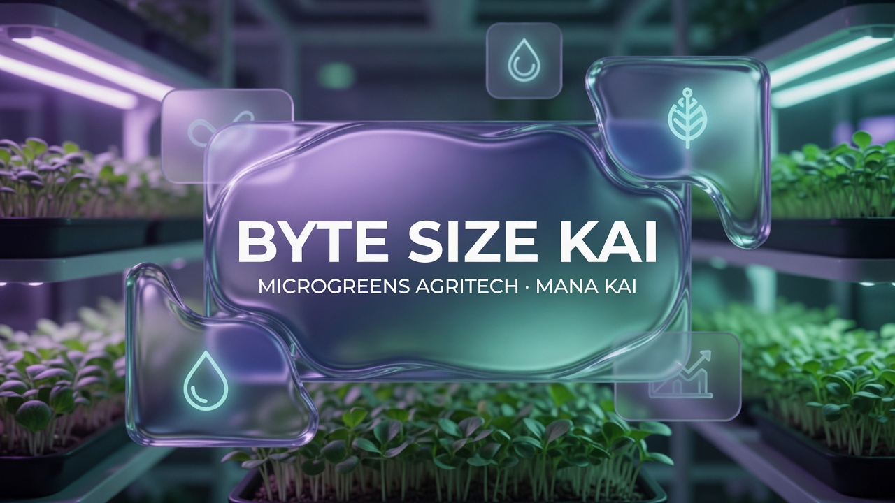
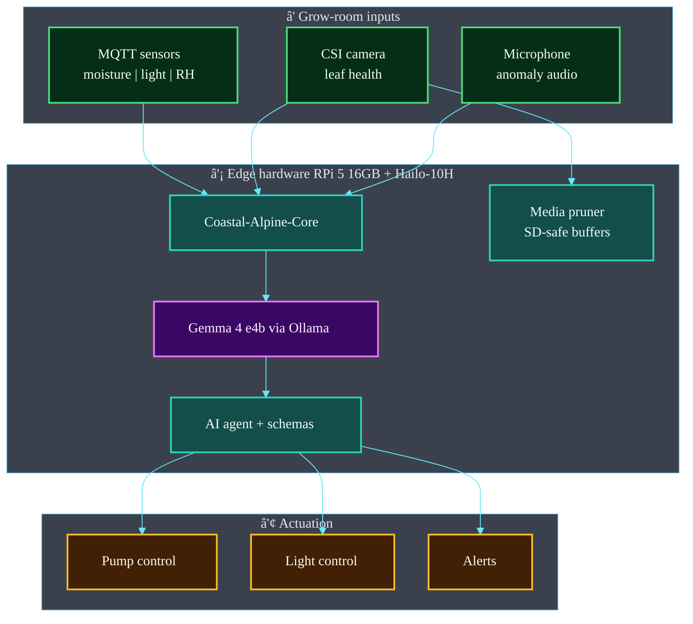

# Byte Size Kai

<!-- BEGIN CAT_CONGRUENCE_SNIPPET -->
## Coastal Alpine Tech portfolio

[](https://github.com/fivepanelhat/fivepanelhat)
[](https://github.com/fivepanelhat/fivepanelhat)
[](./.github/agent-fleet/AGENTS.md)
[](https://github.com/fivepanelhat/fivepanelhat)

**Part of the [Kiwi Edge AI Stack](https://github.com/fivepanelhat/fivepanelhat)** | Founder OS: [NZ-Start-Up](https://github.com/fivepanelhat/NZ-Start-Up) | Agent policy: [`.github/agent-fleet/`](./.github/agent-fleet/)

> Sovereign hybrid edge AI for NZ farms and founders - local-first + multi-model, Te Mana Raraunga aligned - collaborating with Venture Taranaki, startups.com investors and Kotahitanga Investment Fund (HITL + cultural advisory for formal approaches).

**Agents inform, draft, prepare, monitor, and remind. Humans advise, sign, file, send, and pay.**  
Anti-hallucination policy: [`.github/agent-fleet/anti-hallucination.md`](./.github/agent-fleet/anti-hallucination.md) | Congruence: [`CAT_CONGRUENCE.md`](./CAT_CONGRUENCE.md)
<!-- END CAT_CONGRUENCE_SNIPPET -->

## Repository identity

| Name | Use |
|------|-----|
| **Byte Size Kai** | Product brand (growers, Mana Kai partners, org front page) |
| **Byte-Size-Kai** | GitHub repository (this repo) |
| *Blue-Moon-Portal* | **Former** repo name — GitHub redirects old URLs |

This repository **is** Byte Size Kai on the Kiwi Edge stack (RPi 5 16GB + Hailo-10H, Core SDK, local Ollama).


[](./LICENSE)
[](https://www.python.org)
[](https://ollama.com)

[](https://github.com/fivepanelhat/Byte-Size-Kai)
[](https://github.com/fivepanelhat/Byte-Size-Kai)
[](https://github.com/fivepanelhat/Byte-Size-Kai)
[](https://github.com/fivepanelhat/Byte-Size-Kai)

[](https://anthropic.com)
[](https://gemini.google.com)
[](https://openai.com)
[](https://x.ai)

[](https://github.com/fivepanelhat/Byte-Size-Kai)
[](https://mosquitto.org)
[](https://github.com/fivepanelhat/Byte-Size-Kai)
[](https://www.eeca.govt.nz)

[](https://github.com/fivepanelhat/Byte-Size-Kai/actions/workflows/ci-scan.yml)
[](https://github.com/fivepanelhat/Byte-Size-Kai/actions/workflows/secops.yml)
[](https://github.com/fivepanelhat/Byte-Size-Kai/actions/workflows/redteam.yml)
[](https://github.com/fivepanelhat/Byte-Size-Kai/security/dependabot)

**Coastal Alpine Tech Limited**  pre-seed startup, New Plymouth, Taranaki, Aotearoa New Zealand.




**Byte Size Kai** is Coastal Alpine Tech's agritech product for sovereign, on-farm microgreen and crop intelligence. Clone/CI path: `https://github.com/fivepanelhat/Byte-Size-Kai`.

## The 5 Ws: Project Context

- **Who:** Built by Coastal Alpine Tech Limited, supporting the Horowhenua Mana Kai Project.
- **What:** A multi-modal, agentic IoT pipeline that ingests sensor telemetry, audio, and visual data to autonomously manage and predict crop yields.
- **Where:** Deployed on-site in Horowhenua, New Zealand (Engineered at HQ in New Plymouth, Taranaki).
- **When:** Active development. We are building the sovereign digital infrastructure of tomorrow, today.
- **Why:** To establish localized data sovereignty. Relying on cloud compute for real-time agricultural decisions introduces latency and creates dependencies. We are bringing the brain directly to the soil.

## Autonomy (edge agents)

Agents **inform, draft, prepare, monitor, and remind**. Physical actuation and commercial decisions stay human-in-the-loop unless an explicit local allow-list is configured on-site.

## The Problems We Are Solving

1. **Cloud Dependency & Latency:** Agricultural hardware shouldn't stop working when the internet drops. We are moving inference to the edge.
2. **Unstructured IoT Data:** Sensors generate massive amounts of noise. We are solving the problem of parsing raw floats and integers into structured, deterministic JSON for automated actions.
3. **Fragmented Context:** Traditional setups look at water levels or camera feeds in isolation. We are building a multi-modal agent that contextualizes soil moisture alongside visual leaf health and ambient acoustic data.

## Quick Start

### Prerequisites

- Raspberry Pi 5 (16GB RAM) with Raspberry Pi AI Accelerator / AI HAT+ 2 (Hailo-10H NPU)
- ESP32 microcontrollers for sensor integration
- Python 3.10+
- Ollama (local LLM runtime)
- Gemma 4 E4B-it model (via `ollama pull gemma4:e4b`)

### Installation & Setup

We provide separate guides for system environment setup and installation for Windows and Linux users:

* **Prerequisites & System Setup Guide**: Read [setup.md](setup.md)
* **Installation Guide**: Read [installation.md](installation.md)

### Quick Start (Automated Setup)
The fastest way to install is running the cross-platform bootstrap script:

```bash
python bootstrap.py
```


### Manual Installation (Bare Metal + Virtual Environment)

<details open>
<summary><strong>Linux / macOS (Bash)</strong></summary>

```bash
# Clone the repository
git clone https://github.com/fivepanelhat/Byte-Size-Kai.git
cd Byte-Size-Kai

# Create virtual environment
python3 -m venv venv
source venv/bin/activate

# Install dependencies
pip install -r requirements.txt

# Copy environment template and configure
cp .env.example .env
# Edit .env with your settings (MQTT broker, Ollama host, etc.)
```

</details>

<details>
<summary><strong>Windows (PowerShell)</strong></summary>

```powershell
# Clone the repository
git clone https://github.com/fivepanelhat/Byte-Size-Kai.git
cd Byte-Size-Kai

# Create virtual environment
python -m venv venv
.\venv\Scripts\Activate.ps1

# Install dependencies
pip install -r requirements.txt

# Copy environment template and configure
Copy-Item .env.example .env
# Edit .env with your settings (MQTT broker, Ollama host, etc.)
```

> **Note:** If you receive an execution policy error, run `Set-ExecutionPolicy -Scope CurrentUser RemoteSigned` first.

</details>

### Ollama Model Setup

Before running the portal, ensure Ollama is running and the Gemma 4 model is downloaded:

```bash
# Terminal 1: Start Ollama server
ollama serve

# Terminal 2: Pull the Gemma 4 model
ollama pull gemma4:e4b

# Verify installation
ollama list
# Expected output: gemma4:e4b     c6eb396dbd59  9.6 GB  <timestamp>
```

### System Validation

Before running the portal in production, run the validation script to verify all components:

```bash
python validate.py
```

This will test:

- âœ" Configuration loading from `.env`
- âœ" Ollama connectivity and model availability
- âœ" MQTT broker connectivity
- âœ" Audio/Video capture streams
- âœ" Hardware control simulation
- âœ" Media pruner functionality
- âœ" AI Agent methods and LLM integration

**Expected output (6-7/7 tests pass):**

```plaintext
âœ" PASS: configuration
âœ" PASS: ollama
âœ" PASS: mqtt (or âœ- FAIL if broker not running)
âœ" PASS: av_capture
âœ" PASS: hardware_control
âœ" PASS: media_pruner
âœ" PASS: ai_agent_methods
```

**Note:** MQTT test may fail if no broker is running locallythis is expected in development. The portal will attempt reconnection at runtime.

### Running the Portal

```bash
# Start the main orchestrator
python main.py
```

The portal will:

1. Connect to your MQTT broker for sensor telemetry
2. Initialize audio/video capture streams
3. Perform health checks on all subsystems
4. Begin processing sensor data through Gemma 4 via Ollama
5. Run background media pruning (auto-cleanup of old AV buffers)

## Architecture Overview

> **Diagrams:** Architecture images and Mermaid maps describe the **target product architecture** for this pre-seed stack. They are engineering design maps  not claims of large-scale commercial fleet deployment.

Byte Size Kai is a closed-loop **microgreens / crop** edge agent for Byte Size Kai. MQTT sensors, CSI vision, and audio drive local multimodal Gemma 4 on **RPi 5 16GB + Hailo-10H** with deterministic hardware control.


### System map



 | Layer | Components | Role |
 | :--- | :--- | :--- |
 | **Inputs** | Sensors + vision + audio | Multi-modal crop state |
 | **Reasoning** | Gemma 4 multimodal | Local, offline |
 | **Control** | Pumps | lights | alerts | Deterministic JSON plans |
 | **Storage** | Media pruner | Prevents SD saturation |

*Full detail: [ARCHITECTURE.md](./ARCHITECTURE.md) | [HARDWARE_SETUP.md](./HARDWARE_SETUP.md)*

## Directory Structure

```plaintext
Blue_Moon_Portal/
â"‚
â"œâ"€â"€ portal_core/               # The Engine Room
â"‚   â"œâ"€â"€ __init__.py
â"‚   â"œâ"€â"€ ai_agent.py            # Multi-modal LLM controller (Gemma 4 via Ollama)
â"‚   â"œâ"€â"€ mqtt_client.py         # Paho MQTT subscriber for ESP32 telemetry
â"‚   â"œâ"€â"€ av_capture.py          # OpenCV/PyAudio streams (CSI camera + mic)
â"‚   â""â"€â"€ media_pruner.py        # Storage lifecycle management (auto-delete/compress)
â"‚
â"œâ"€â"€ portal_schemas/            # The Rulebook (Pydantic enforcement)
â"‚   â"œâ"€â"€ __init__.py
â"‚   â""â"€â"€ ai_models.py           # Pydantic classes (SensorReading, AnalysisResult, CropOptimizationPlan)
â"‚
â"œâ"€â"€ telemetry_data/            # Local Knowledge Base
â"‚   â"œâ"€â"€ sensor_logs/           # Historical MQTT JSON payloads
â"‚   â""â"€â"€ media/                 # Image and audio buffer storage
â"‚
â"œâ"€â"€ requirements.txt           # Python dependencies
â"œâ"€â"€ requirements-dev.txt       # Development tools (pytest, black, mypy)
â"œâ"€â"€ main.py                    # Asynchronous event loop orchestrator
â"œâ"€â"€ setup.py                   # Package configuration
â"œâ"€â"€ .env.example               # Environment variable template
â"œâ"€â"€ .gitignore                 # Git exclusions (media, .env, __pycache__)
â"œâ"€â"€ blue-moon.service          # Systemd service for auto-start on boot
â"‚
â"œâ"€â"€ README.md                  # This file
â"œâ"€â"€ ARCHITECTURE.md            # Detailed technical breakdown
â"œâ"€â"€ HARDWARE_SETUP.md          # RPi5 + Hailo-10H NPU assembly & driver installation
â""â"€â"€ DEVELOPMENT.md             # Local dev setup, mocking, testing
```

## Documentation

- **[ARCHITECTURE.md](ARCHITECTURE.md)**  Data flow, module responsibilities, Gemma 4 config, Pydantic schema definitions
- **[HARDWARE_SETUP.md](HARDWARE_SETUP.md)**  RPi 5 + Hailo-10H NPU assembly, ESP32 wiring, Ollama installation, **critical NPU driver setup**
- **[DEVELOPMENT.md](DEVELOPMENT.md)**  Local dev environment, mock MQTT payloads, testing strategies

## Technology Stack

### Hardware

- **Compute:** Raspberry Pi 5 (16GB RAM)
- **Acceleration:** Raspberry Pi AI Accelerator / AI HAT+ 2 (Hailo-10H NPU, 40 TOPS)
- **Sensors:** ESP32 microcontrollers streaming via MQTT
- **Cameras:** CSI camera module (leaf health)
- **Audio:** USB microphone (anomaly detection)

### Software

- **Language:** Python 3.10+
- **LLM Runtime:** Ollama (local, no cloud)
- **Model:** Gemma 4 E4B (4B effective parameters, multi-modal)
- **Message Queue:** Paho MQTT
- **Schema Enforcement:** Pydantic (prevents LLM hallucinations)
- **Media Capture:** OpenCV + PyAudio
- **Process Management:** Systemd (auto-start on boot)

## Key Features

âœ" **Edge-Native:** All inference runs locally on RPi 5. No cloud dependency.
âœ" **Multi-Modal AI:** Simultaneously processes sensor telemetry, visual, and audio data.
âœ" **Deterministic Output:** Pydantic schemas prevent conversational hallucinations; LLM must output valid JSON or fail loudly.
âœ" **Auto-Recovery:** Systemd service ensures portal restarts after power loss.
âœ" **Storage-Aware:** Automated media pruning prevents 24/7 AV capture from filling the SD card.
- **Source transparency:** Public engineering repo under the Coastal Alpine Tech proprietary licence (see `LICENSE`) — not an open-source grant.
- **Honesty:** Pre-seed target architecture; see [REALITY.md](./REALITY.md).

---

## Performance & Benchmarks

> **Illustrative / re-measure on your hardware.** Not audited production SLAs. Informal ballparks on RPi 5 16GB + Hailo-10H + local Ollama; re-run before quoting externally.

- **Local inference latency:** order of ~1 second per routing/query class workload (model- and load-dependent).
- **Energy:** NPU-assisted vision workloads are designed for low power edge draw — measure joules on your node via Core telemetry.
- **Storage:** media pruner is intended to keep AV buffers bounded on SD cards; retention policy is site-configured.

---

## Contributing

This repository is **proprietary** (Coastal Alpine Tech Limited). External contributions require a written agreement. Agritech and edge AI partners interested in pilots should open a GitHub Discussion/Issue for commercial contact — do not assume an open-source CLA.

### Getting Started as a Contributor

1. Fork the repository
2. Create a feature branch: `git checkout -b feature/your-feature`
3. Follow the development guide in [DEVELOPMENT.md](DEVELOPMENT.md)
4. Submit a pull request

### Code Standards

- Type hints required (validated with `mypy`)
- Docstrings for all public functions and classes
- Black formatting (`black .`)
- Unit tests with `pytest`

## License

This project is Licensed under the Coastal Alpine Tech Limited License. See `LICENSE` for details.

## Attribution

**Built by:** Wayne Roberts, Coastal Alpine Tech Limited
**Supporting:** Horowhenua Mana Kai Project
**Location:** New Plymouth, Taranaki / Horowhenua, New Zealand
**Date:** Active development (as of May 31, 2026)

**Reference:**
[Running Gemma 4 E4B Locally](https://www.youtube.com/watch?v=NB9zRquoeI0)  Hardware constraints and edge configuration walkthrough.

---

**Questions?** Open an issue or reach out to the Coastal Alpine Tech Limited team.
