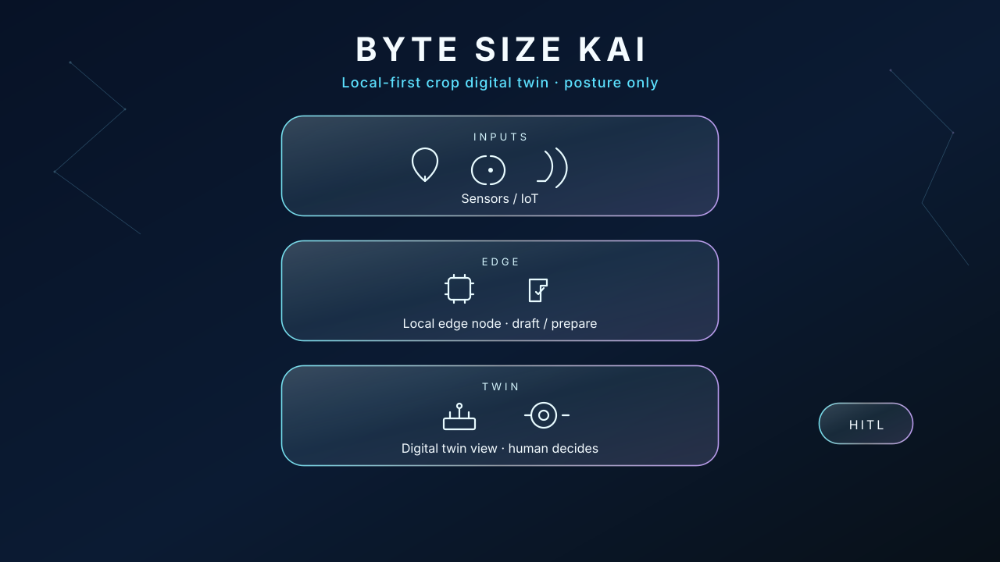

# Byte Size Kai

[](./PUBLIC_POSTURE.md)
[](./COMPLIANCE.md)
[](./COMPLIANCE.md)
[](./COMPLIANCE.md)
[](./SECURITY.md)
[](https://github.com/fivepanelhat/fivepanelhat/blob/main/GOVERNANCE.md)
[](./LICENSE)


**Byte Size Kai turns on-paddock sensor telemetry into a local-first crop digital twin — agents draft what the data suggests; humans decide what happens next.**

**Coastal Alpine Tech Limited** — pre-seed, Taranaki, Aotearoa New Zealand.

Part of the [Kiwi Edge AI Stack](https://github.com/fivepanelhat/fivepanelhat) (public posture).

**Agents inform, draft, prepare, monitor, and remind. Humans advise, sign, file, send, pay, and actuate.**

## What it does

Sovereign, local-first crop intelligence under hard Human-in-the-Loop: sensors on whenua, inference at the edge, a digital twin that stays on-site unless a human authorises a move.

```text
  Sensors / IoT     →   Edge node (local)     →   Digital twin view
  (telemetry only)      (draft / prepare)          (human decides)
```



The diagram is posture-only. No bill of materials, no install path, no commissioning steps.

A clone of this repository is **not** a controller. See [`NOTICE.md`](./NOTICE.md).

## How to evaluate

This public tree is posture only. Evaluation is not `git clone` + install.

1. Read [`PUBLIC_POSTURE.md`](./PUBLIC_POSTURE.md) and [`NOTICE.md`](./NOTICE.md).
2. Open the **simulated console** (not a live node): [field-brave-palm-lagoon.grok.me/kai](https://field-brave-palm-lagoon.grok.me/kai).
3. Architecture UI (same console, twin layer): [field-brave-palm-lagoon.grok.me/architecture?layer=twin](https://field-brave-palm-lagoon.grok.me/architecture?layer=twin).
4. Runtime, firmware, hardware packs, and pilot evaluation materials are available under **written agreement only** — email **fivepanelhat@gmail.com** (no prices or methods on public GitHub).
5. Security findings: use [private vulnerability reporting](https://github.com/fivepanelhat/Byte-Size-Kai/security/advisories/new), not a public issue. See [`SECURITY.md`](./SECURITY.md).

Cite this public door with [`CITATION.cff`](./CITATION.cff). Licence: proprietary — [`LICENSE`](./LICENSE) (`LicenseRef-CoastalAlpineTech-Proprietary`).

## Try the Digital Twin

Simulated console — not a live node. Same forest-glass commercial-entry UI as SprintIT · MintIT.

**[Open console](https://field-brave-palm-lagoon.grok.me/kai)** · **[Architecture UI](https://field-brave-palm-lagoon.grok.me/architecture?layer=twin)**

## Field context (claim hygiene)

Horowhenua Mana Kai is **early tests / pilot context only**.

- Early field **tests** (not a production on-site deployment) successfully took telemetry from IoT sensors.
- This repository does **not** claim a live deployment fleet, iwi mandate, or partner programme.

See [`PUBLIC_POSTURE.md`](./PUBLIC_POSTURE.md).

## Partnership enquiries

For partnership or pilot enquiries: **[fivepanelhat@gmail.com](mailto:fivepanelhat@gmail.com)**.

## Public docs (posture only)

| Doc | Purpose |
| :--- | :--- |
| [`NOTICE.md`](./NOTICE.md) | What a clone is / is not |
| [`ARCHITECTURE.md`](./ARCHITECTURE.md) | Architecture posture (no install/bring-up) |
| [`PUBLIC_POSTURE.md`](./PUBLIC_POSTURE.md) | Claim hygiene |
| [`COMPLIANCE.md`](./COMPLIANCE.md) | Privacy / Te Mana Raraunga / HITL |
| [`SECURITY.md`](./SECURITY.md) | Security posture |
| [`COMPLIANCE_REGIONS.md`](./COMPLIANCE_REGIONS.md) | Regional packs pointer (detail private) |
| [Governance](https://github.com/fivepanelhat/fivepanelhat/blob/main/GOVERNANCE.md) | Company HITL autonomy ceiling |
| [CAT Sovereign Governance Layer](https://github.com/fivepanelhat/fivepanelhat/blob/main/docs/public/cat-sovereign-governance-layer.md) | Mutual protection / due-diligence posture |
| [Safe NZ AI](https://github.com/fivepanelhat/fivepanelhat/blob/main/SAFE_NZ_AI.md) | Operating description — not a government badge |
| [Trust Center](https://github.com/fivepanelhat/fivepanelhat/blob/main/TRUST_CENTER.md) | Public trust posture |

**No public getting-started or installation guides.** Install, bootstrap, hardware commissioning, runtime packs, skill bodies, and R&D artefact indexes are commercial-track / private.

## Privacy / security / governance

| Commitment | Statement |
| :--- | :--- |
| **No data sales** | We do not sell personal or customer operational data to third parties for ads or brokerage. |
| **NZ Privacy Act 2020** | Designed in accordance with the Privacy Act 2020. |
| **Te Mana Raraunga** | Designed in accordance with Te Mana Raraunga principles where Māori data interests arise. |
| **HITL** | Agents draft/prepare; humans approve high-stakes outcomes. See [Governance](https://github.com/fivepanelhat/fivepanelhat/blob/main/GOVERNANCE.md). |

## License

Proprietary — Coastal Alpine Tech Limited. SPDX: `LicenseRef-CoastalAlpineTech-Proprietary`. See `LICENSE`.

## Attribution

**Built by:** Coastal Alpine Tech Limited  
**Field context:** Horowhenua Mana Kai — early **tests only** (successfully took IoT telemetry; not a claimed on-site deployment)  
**Location:** Taranaki, Aotearoa New Zealand
